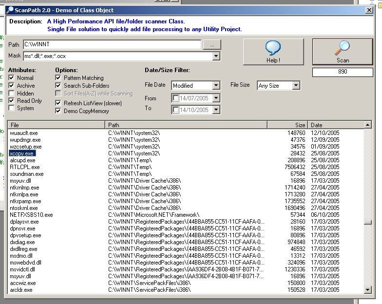



## ScanPath 2\.0\.1 \(13 Feb 06\)

### Description

Fast API based file/folder scanner. Single File solution with no dependencies to add file processing to any Utility Project in single step. Scans a path (applying optional Attribute, Mask, Date and Size filters + multiple file extensions and simple pattern matching). Can also optionally scan nested sub-folders and/or sort results. Returns the files &amp; folders by raising events. I originally created this a few years ago when I was creating many File Utilities. Hope it may be useful as example of API file handling and WithEvents. I welcome feedback (votes always appreciated)!

UPDATE: Fixed a resource leak and simplified the use of extended file details.
 
### More Info
 

             |
---                |---
**Submitted On**   |2005-09-01 10:48:46
**By**             |[Richard Mewett](https://github.com/Planet-Source-Code/PSCIndex/blob/master/ByAuthor/richard-mewett.md)
**Level**          |Intermediate
**User Rating**    |4.9 (84 globes from 17 users)
**Compatibility**  |VB 6\.0
**Category**       |[Files/ File Controls/ Input/ Output](https://github.com/Planet-Source-Code/PSCIndex/blob/master/ByCategory/files-file-controls-input-output__1-3.md)
**World**          |[Visual Basic](https://github.com/Planet-Source-Code/PSCIndex/blob/master/ByWorld/visual-basic.md)
**Archive File**   |[ScanPath\_21972872132006\.zip](https://github.com/Planet-Source-Code/richard-mewett-scanpath-2-0-1-13-feb-06__1-62882/archive/master.zip)

